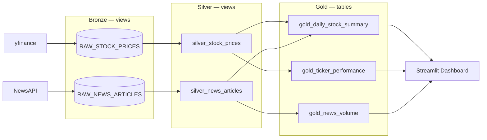
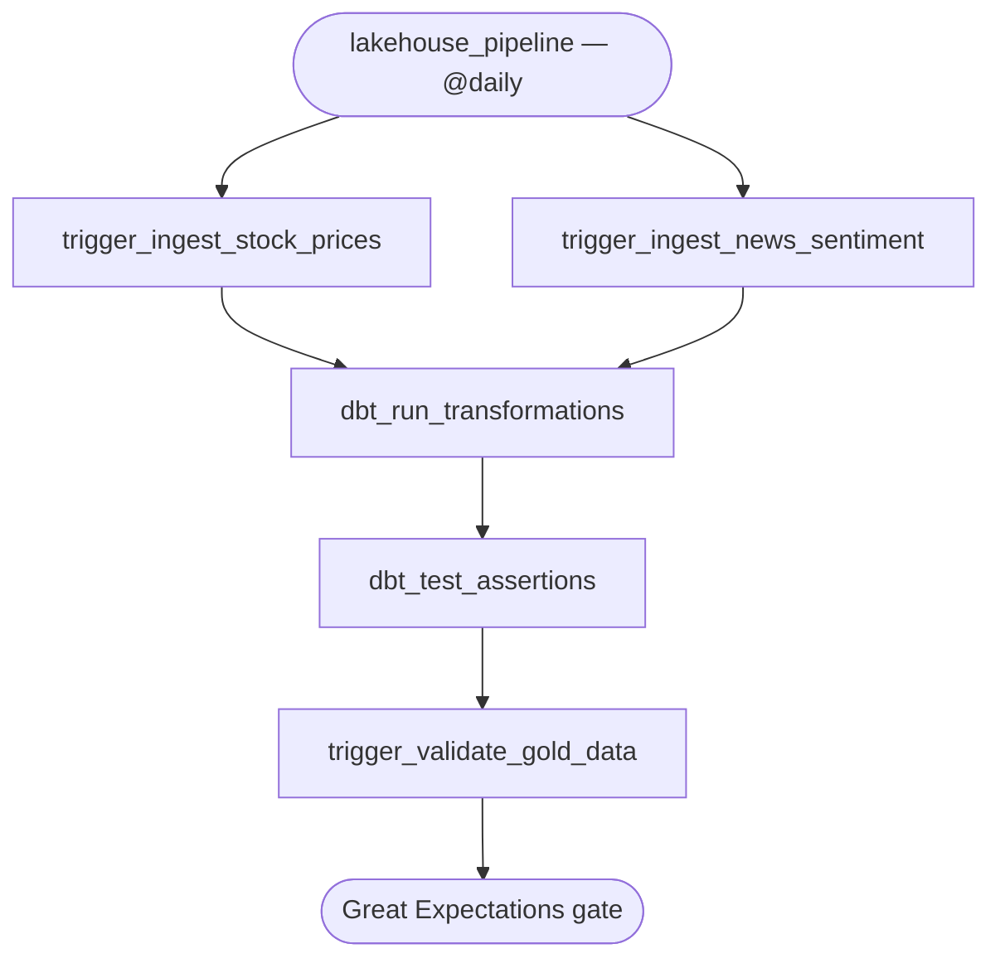

# Financial Data Lakehouse

A daily-batch data platform that ingests stock prices and related news coverage, transforms them through a Medallion architecture in Snowflake with dbt, gates the output with an automated data-quality check, and serves the result through a Streamlit dashboard — all orchestrated by Apache Airflow and validated on every push by CI.

[](https://www.python.org/)
[](https://airflow.apache.org/)
[](https://www.getdbt.com/)
[](https://www.snowflake.com/)
[](https://streamlit.io/)
[](https://github.com/iSiddharthrajput/financial-data-lakehouse/actions/workflows/dbt_ci.yml)

---

## Table of Contents

- [Overview](#overview)
- [Architecture](#architecture)
- [Tech Stack](#tech-stack)
- [Repository Structure](#repository-structure)
- [Data Pipeline (Medallion Architecture)](#data-pipeline-medallion-architecture)
- [Orchestration](#orchestration)
- [Data Quality and Testing](#data-quality-and-testing)
- [Dashboard](#dashboard)
- [Getting Started](#getting-started)
- [Engineering Decisions](#engineering-decisions)
- [Known Limitations and Roadmap](#known-limitations-and-roadmap)
- [Skills Demonstrated](#skills-demonstrated)
- [Author](#author)

---

## Overview

Every day, this pipeline:

1. Pulls 30-day OHLCV price history for 12 tickers (`NVDA`, `AAPL`, `MSFT`, `GOOGL`, `META`, `AMZN`, `TSLA`, `AMD`, `PLTR`, `SNOW`, `NET`, `JPM`) from `yfinance`, and up to 20 recent news articles per ticker from NewsAPI.
2. Loads both raw datasets into a **Bronze** schema in Snowflake.
3. Runs a **dbt Core** project that cleans, deduplicates, and enriches the data through **Silver**, then aggregates it into analytics-ready **Gold** tables.
4. Runs a **Great Expectations** suite against the Gold layer as an automated pass/fail quality gate.
5. Serves the Gold tables through a **Streamlit** dashboard for price trends, rolling averages, and media-attention correlation.

The whole sequence is orchestrated by **Apache Airflow** running in Docker, and every push/PR is checked by a **GitHub Actions** workflow that compiles the dbt project against a live Snowflake connection and smoke-tests that all DAGs import cleanly.

This is a personal data-engineering project, built to practice the full lifecycle of a batch analytics platform — not just the transformation logic, but the orchestration, idempotency, testing, and CI/CD around it.

## Architecture



Ingestion and transformation are coordinated by a master Airflow DAG (see [Orchestration](#orchestration)), and a Great Expectations suite sits between the Gold layer and the dashboard as a quality gate.

## Tech Stack

| Layer | Tool | Details |
|---|---|---|
| Orchestration | Apache Airflow 2.9.3 (Docker, `LocalExecutor`) | 4 DAGs — see [Orchestration](#orchestration) |
| Data Warehouse | Snowflake | Bronze / Silver / Gold schemas |
| Transformations | dbt Core 1.9 + `dbt-snowflake` | 7 models across 3 layers |
| Data Quality | dbt schema + singular tests, Great Expectations 1.x | Two independent validation layers |
| Dashboard | Streamlit | Live queries against the Gold layer, 10-min result cache |
| CI/CD | GitHub Actions | dbt compile + Airflow DAG-import smoke tests on every push/PR |
| Data Sources | `yfinance`, NewsAPI | 12 tickers, 30-day price window, 20 articles/ticker/day |
| Language | Python 3.11, SQL (Jinja/dbt) | |

## Repository Structure

```
financial-data-lakehouse/
├── .github/workflows/
│   └── dbt_ci.yml                    # CI: dbt compile + Airflow DAG smoke tests
├── airflow/
│   ├── dags/
│   │   ├── ingest_stock_prices.py    # yfinance → Snowflake BRONZE
│   │   ├── ingest_news_sentiment.py  # NewsAPI → Snowflake BRONZE
│   │   ├── lakehouse_pipeline.py     # Master orchestrator DAG
│   │   └── validate_gold_data.py     # Great Expectations quality gate
│   └── dbt-profile/
│       └── profiles.yml
├── dashboard/
│   └── app.py                        # Streamlit dashboard
├── dbt/
│   ├── models/
│   │   ├── bronze/                   # Source-conformed staging views
│   │   ├── silver/                   # Cleaned, deduplicated, enriched views
│   │   └── gold/                     # Analytics-ready tables
│   ├── tests/                        # Singular dbt tests
│   └── dbt_project.yml
├── scripts/
│   └── validate_data.py              # Standalone Great Expectations entrypoint
├── tests/
│   └── test_dag_import.py            # Airflow DAG import smoke test
├── docker-compose.yaml               # Airflow + Postgres services
├── requirements.txt
└── .env.example
```

## Data Pipeline (Medallion Architecture)

<details>
<summary><strong>Bronze — raw, source-conformed (views)</strong></summary>

- `RAW_STOCK_PRICES` and `RAW_NEWS_ARTICLES` are loaded directly by the Airflow ingestion DAGs via `write_pandas(..., auto_create_table=True)` — no manual DDL.
- `stg_stock_prices` / `stg_news_articles` are thin dbt passthrough views that standardize column casing and pull the raw tables into the dbt lineage graph.

</details>

<details>
<summary><strong>Silver — cleaned and deduplicated (views)</strong></summary>

- **`silver_stock_prices`**: deduplicates on `(ticker, date)` using `ROW_NUMBER()` keyed to the latest `ingested_at` (safe against DAG retries and re-runs), drops zero-volume/null-close rows, and computes `daily_return_pct` and `price_range`.
- **`silver_news_articles`**: deduplicates on `(ticker, url)`, trims text fields, and filters out null, empty, or `[Removed]` headlines (NewsAPI's placeholder for retracted articles).

</details>

<details>
<summary><strong>Gold — analytics-ready (tables)</strong></summary>

- **`gold_daily_stock_summary`**: one row per ticker per day — price metrics left-joined with same-day news article counts. The dashboard's primary table.
- **`gold_ticker_performance`**: 7-day and 30-day rolling average close, 7-day rolling volume, and 7-day rolling average return, computed with SQL window functions partitioned by ticker.
- **`gold_news_volume`**: daily article count per ticker, plus the distinct list of sources and the earliest/latest article timestamp — for correlating media attention with price movement.

</details>

Bronze and Silver are materialized as **views** (cheap to iterate on, no duplicated storage while the shape of the data is still settling); Gold is materialized as **tables** for fast, predictable dashboard reads.

## Orchestration

Four DAGs, each with a single responsibility:

| DAG | Schedule | Role |
|---|---|---|
| `ingest_stock_prices` | Trigger-only | Pulls OHLCV data from `yfinance`, writes to `BRONZE.RAW_STOCK_PRICES` |
| `ingest_news_sentiment` | Trigger-only | Pulls articles from NewsAPI, writes to `BRONZE.RAW_NEWS_ARTICLES` |
| `validate_gold_data` | Trigger-only | Runs the Great Expectations suite against the Gold layer |
| `lakehouse_pipeline` | `@daily` | Master DAG — fans out ingestion, then chains transform → test → validate |



The two ingestion DAGs are intentionally left unscheduled (`schedule_interval=None`) and only run when triggered by the master DAG or manually — this keeps ingestion independently re-runnable/backfillable without needing to re-trigger the whole pipeline.

## Data Quality and Testing

Data quality is enforced at two independent points, using two different tools, so a bad batch is caught before it reaches the dashboard:

**dbt (build-time):**
- Schema tests: `not_null` on key columns across Silver and Gold, plus `accepted_values` on `ticker` enforcing the 12-symbol whitelist on every Gold model.
- Singular tests: `assert_positive_stock_price` (no `close <= 0`) and `assert_unique_ticker_date` (no duplicate `(ticker, date)` pairs) in `gold_daily_stock_summary`.

**Great Expectations (post-transform gate):** `validate_gold_data` runs 5 expectations against `GOLD_DAILY_STOCK_SUMMARY` — non-null OHLCV/ticker, non-negative volume, `daily_return_pct` within ±50%, and `high >= low` / `high >= close` — and raises to fail the Airflow task if any check doesn't pass.

**CI (GitHub Actions):** on every push and PR, one job runs `dbt debug` + `dbt compile` against a live Snowflake connection (using repo secrets) to catch connection and compilation issues without incurring the cost of a full `dbt run`; a second job runs `pytest` to confirm all Airflow DAGs import without errors.

## Dashboard

The Streamlit app (`dashboard/app.py`) queries the Gold layer directly, with results cached for 10 minutes to limit Snowflake credit usage. It includes:

- A ticker selector, backed by a live query with a hardcoded fallback list if Snowflake is unreachable — and every selection is re-validated against that list before being used in a query, on top of parameterized SQL.
- Four headline metrics: latest close (with day-over-day delta), volume, intraday volatility (`high - low`), and today's news article count.
- Two tabs: close price with 7-day/30-day moving averages, and a side-by-side view of price vs. news volume for eyeballing correlation.
- A feed of the 10 most recent articles per ticker, pulled from the Silver layer with HTML-escaped rendering to avoid injecting unescaped third-party content into the page.

> Add a screenshot or short GIF of the dashboard here — this is the single highest-leverage addition for recruiter engagement (see [Known Limitations and Roadmap](#known-limitations-and-roadmap)).

## Getting Started

### Prerequisites

- Docker & Docker Compose
- Python 3.11+
- A Snowflake account (trial works)
- A free [NewsAPI](https://newsapi.org/) key

### Setup

**1. Clone and configure environment variables**

```bash
git clone https://github.com/iSiddharthrajput/financial-data-lakehouse.git
cd financial-data-lakehouse
cp .env.example .env
```

> **Note:** `docker-compose.yaml` also references `POSTGRES_PASSWORD`, `AIRFLOW_FERNET_KEY`, and `AIRFLOW_ADMIN_PASSWORD`, which aren't in `.env.example` yet — add them to your `.env` as well. `POSTGRES_USER` and `POSTGRES_DB` are optional (both default to `airflow`). Generate a Fernet key with:
> ```bash
> python -c "from cryptography.fernet import Fernet; print(Fernet.generate_key().decode())"
> ```

**2. Start Airflow**

```bash
docker compose up -d --build
```

Visit `http://localhost:8080` (default admin user is whatever you set via `AIRFLOW_ADMIN_PASSWORD`).

**3. Add a Snowflake connection in the Airflow UI**

The ingestion and validation DAGs authenticate via `SnowflakeHook(snowflake_conn_id='snowflake_conn')`, so this connection has to be created once, manually, under **Admin → Connections**:

- **Conn Id:** `snowflake_conn`
- **Conn Type:** Snowflake
- **Login / Password:** your Snowflake username / password
- **Extra:**
  ```json
  {
    "account": "your_snowflake_account_locator",
    "database": "FINANCIAL_DB",
    "warehouse": "FINANCIAL_WH",
    "role": "DBT_ROLE"
  }
  ```

**4. Run the unit tests**

```bash
pip install -r requirements.txt
pytest tests/
```

**5. Run dbt locally (optional — Airflow runs this automatically)**

```bash
cd dbt
dbt run --profiles-dir ../airflow/dbt-profile
```

> dbt's default schema-naming behavior prefixes custom schemas with the profile's base schema (`BRONZE`), so the Silver and Gold models actually land in `BRONZE_SILVER` and `BRONZE_GOLD` in Snowflake — not schemas literally named `SILVER` / `GOLD`. The dashboard and validation scripts already query the correct, prefixed names.

**6. Launch the dashboard**

```bash
streamlit run dashboard/app.py
```

## Engineering Decisions

A few choices worth calling out, since they're easy to miss on a first read of the code:

- **Idempotent Silver models.** Both Silver models deduplicate with a `ROW_NUMBER() OVER (PARTITION BY ... ORDER BY ingested_at DESC)` pattern, so re-running or backfilling ingestion never produces duplicate rows downstream.
- **Two-layer data quality, on purpose.** dbt tests catch structural issues at build time; Great Expectations runs afterward as a separate, blocking DAG task — so a bad batch fails the pipeline run itself, rather than silently reaching the dashboard's cache.
- **Scoped credentials.** In `docker-compose.yaml`, the Snowflake environment variables are injected only into the `airflow-scheduler` service (where tasks actually execute), not the webserver. NewsAPI errors are caught and the API key is explicitly redacted (`***REDACTED***`) before being logged, in case it ever leaks into an exception message or URL.
- **Company-name-aware news queries.** The NewsAPI ingestion DAG maps each ticker to its company name for the search query (e.g., `GOOGL` → `"Google OR Alphabet"`) rather than searching on the raw ticker symbol, which materially improves match precision.
- **CI that doesn't burn warehouse credits on every commit.** The GitHub Actions workflow runs `dbt debug` and `dbt compile` (real connection, no data movement) instead of a full `dbt run`/`dbt test` against production data on every push, and explicitly deletes the generated `profiles.yml` afterward (`if: always()`).
- **Materialization strategy.** Bronze/Silver as views keep iteration cheap while the transformation logic is still evolving; Gold as tables keeps the dashboard's hot read path fast.

## Known Limitations and Roadmap

Being direct about where this stands today:

- **"News sentiment" is currently news *volume*, not sentiment.** The pipeline tracks article counts per ticker/day as a proxy for media attention — there's no NLP-based polarity/sentiment scoring yet. That's a natural next step (e.g., scoring headlines with VADER or a lightweight transformer model).
- **Reddit/WallStreetBets ingestion is not implemented.** `praw` is already pinned in `requirements.txt` and `docker-compose.yaml` in anticipation, but no DAG exists yet — it's pending Reddit API key approval.
- **No dbt observability layer yet.** Integrating a package like Elementary for lineage, schema-drift detection, and test-coverage reporting is planned but not built.
- **Runtime dependency installation.** The Airflow image installs Python packages at container startup via `_PIP_ADDITIONAL_REQUIREMENTS`, which slows down `docker compose up`. A pre-baked custom image would be faster and more reproducible.
- **Single-node orchestration.** Airflow runs with `LocalExecutor` against a single Postgres instance — appropriate for a project at this scale, not horizontally scaled.
- **30-day rolling window only.** Price history is a 30-day backfill on each run rather than an accumulating historical archive, so there's no long-range trend analysis yet.

## Skills Demonstrated

| Area | Where it shows up |
|---|---|
| Python | Airflow DAGs, ingestion/validation scripts, Streamlit app |
| SQL & dbt | 7 models, Jinja templating, window functions, dedup patterns |
| Apache Airflow | DAG design, `TriggerDagRunOperator` fan-out/chaining, `PythonOperator`/`BashOperator` |
| Snowflake | Schema design, bulk loads via `write_pandas`, connection scoping |
| Data modeling | Medallion (Bronze/Silver/Gold) architecture |
| Data quality & observability | dbt tests + Great Expectations as independent validation layers |
| Docker | Multi-service local orchestration via Docker Compose |
| CI/CD | GitHub Actions, secrets handling, least-privilege permissions |
| API integration | `yfinance` and NewsAPI clients with partial-failure tolerance |
| Security-conscious engineering | Credential redaction, HTML-escaped rendering, scoped secrets |

## Author

**Siddharth Rajput** — [@iSiddharthrajput](https://github.com/iSiddharthrajput)

Built as a hands-on portfolio project to practice the full lifecycle of a batch data platform: ingestion, orchestration, warehousing, transformation, quality-gating, and serving. Issues and suggestions are welcome via GitHub Issues.
